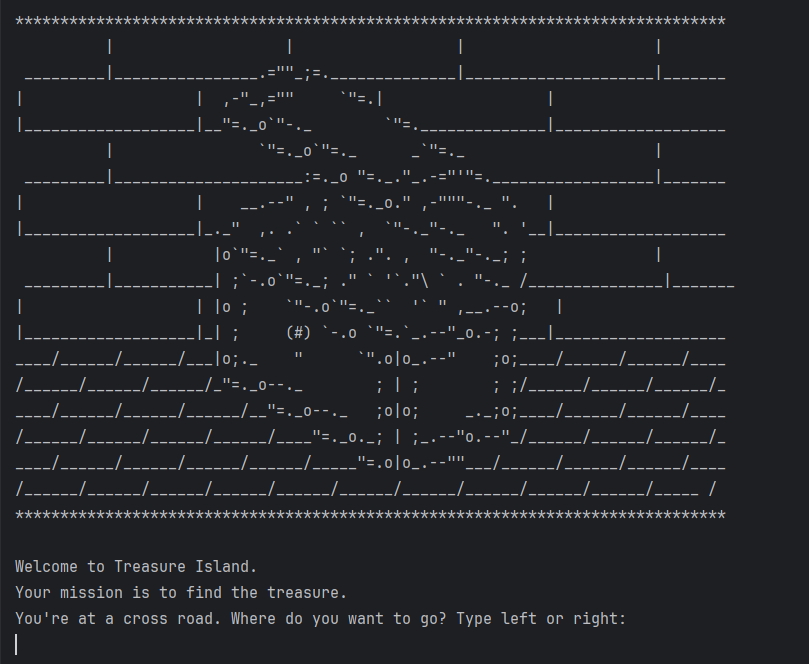

# 🏝️ Treasure Island - Python Text Adventure Game

Welcome to **Treasure Island** – a fun, beginner-friendly, text-based adventure game built using Python!  
Your mission is simple: make the right choices and find the hidden treasure 💰.

---
## 📷 Screenshot


## 🎮 How to Play

This is a terminal-based game where you'll face a series of choices.

```text
You're at a cross road. Where do you want to go? Type left or right:
-> left

You've come to a lake. Type 'wait' to wait for a boat. Type 'swim' to swim across.
-> swim

You arrive at the island. One red, one yellow and one blue door. Which colour do you choose?
-> blue

🎉 You found the treasure! You Win!


